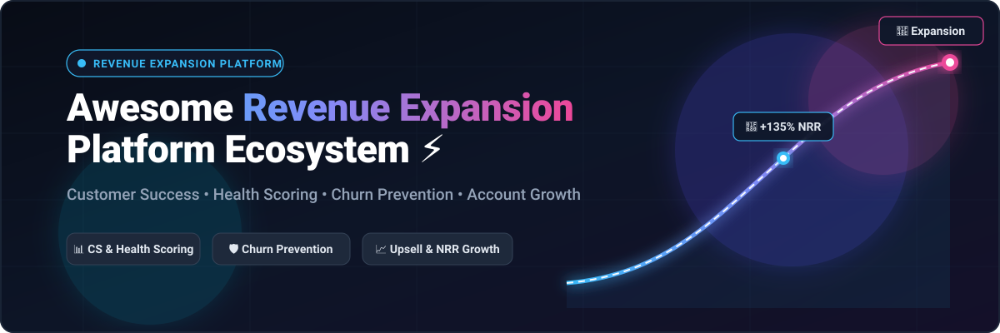

  

# 🚀 Awesome Revenue Expansion Platform

  
  
  
  
  
  

## 🌐 Top Revenue Expansion Platform Ecosystem

> **Curated List of SaaS Products & Open-Source GitHub Projects for Customer Success, Health Scoring, Net Revenue Retention (NRR), Churn Prevention, Client Onboarding & Account Growth** 📈

**Last updated: September 2026** ⚡

---

### 📖 Overview

This repository tracks leading **SaaS platforms** and **open-source software repositories** for **Revenue Expansion**, Customer Success (CS), and Account Retention. These solutions empower Customer Success Managers (CSMs), RevOps leaders, and post-sales teams to track multi-dimensional customer health scores, predict churn patterns, automate client onboarding, orchestrate expansion playbooks, and maximize Net Revenue Retention (NRR) across the customer lifecycle.

**Featured commercial platforms** include category leaders like *Gainsight CS, Totango, Catalyst, Planhat, Vitally, ChurnZero, ClientSuccess, EverAfter, Dock, and Arrows*.

---

## 📑 Table of Contents

- [☁️ SaaS/Hosted Platforms](#️-saashosted-platforms)
  - [📊 Market Landscape & Dynamics](#-market-landscape--dynamics)
  - [🏢 Commercial SaaS Comparison](#-commercial-saas-comparison)
- [🛠️ Open-Source GitHub Projects](#️-open-source-github-projects)
  - [⭐ Featured Open-Source Repositories (Ranked by Stars)](#-featured-open-source-repositories-ranked-by-stars)
  - [🏗️ Architectural Frameworks for Custom In-House Stacks](#️-architectural-frameworks-for-custom-in-house-stacks)
- [🤝 How to Contribute](#-how-to-contribute)
- [📈 Star History](#-star-history)
- [⚖️ Disclaimer](#️-disclaimer)

---

## ☁️ SaaS/Hosted Platforms

### 📊 Market Landscape & Dynamics

> 💡 **Market Size & Sector Landscape**: The global Customer Success and Revenue Expansion software market is estimated at **$2.6B–$3.2B in 2025/2026** and projected to surge past **$6B–$12B by 2030–2034** at an accelerating **15%–22% CAGR**. The sector is **moderately fragmented**—while enterprise category leaders like Gainsight and the merged Totango-Catalyst hold substantial enterprise footprint, significant fragmentation persists across mid-market, PLG-focused, and specialized onboarding workspace niches without a single winner-take-all monopoly.

### 🏢 Commercial SaaS Comparison

*Ranked and sorted in descending order by company size (valuation & annual recurring revenue):*

| Platform | Primary Focus | Company Size (Valuation / ARR) 🏛️ | Pricing (Starting Tier) 💳 | Free Tier / Free Trial Limits 🎁 |
| :--- | :--- | :--- | :--- | :--- |
| **[Gainsight CS](https://www.gainsight.com/)** | Enterprise customer success & product intelligence platform with health scoring, journey orchestration, and deep Salesforce integration. | **~$1.1B Valuation** (~$200M+ ARR; acquired by Vista Equity Partners) | Starts at ~$1,200/user/year (~$24,000/year base tier for Essentials) | 30-day proof-of-concept trial upon demo (full platform access in dedicated sandbox); Gainsight PX offers a free starter tier for up to 100 MAUs |
| **[Totango](https://www.totango.com/)** | Modular customer success platform featuring SuccessBLOCs, multidimensional health scoring, and customer journey orchestration. | **~$350M Valuation** (~$60M+ ARR; merged with Catalyst, backed by Great Hill Partners) | Free forever tier available; paid Enterprise tiers start at ~$1,000/month (~$12,000/year billed annually) | Free forever Community Edition (up to 100 customer accounts, 3 user seats, 500 emails/month); 30-day Enterprise trial |
| **[Catalyst](https://catalyst.io/)** | Customer growth platform focusing on playbook design, cross-functional collaboration, and automated expansion signals. | **~$260M Valuation** (~$25M ARR; merged with Totango in 2024; previously $45M Series B) | Starts at $1,250/month (~$15,000/year billed annually, Growth tier) | 14-day guided sandbox trial upon demo (up to 2,500 customer accounts and 5 custom CRM objects) |
| **[Planhat](https://www.planhat.com/)** | Customer data and lifecycle management platform featuring health monitoring, workflow automation, and revenue expansion visibility. | **~$220M Valuation** (~$30M ARR; raised $50M Series A led by Sprints Capital) | Starts at $1,150/month (billed annually, Start-Up tier with unlimited internal users) | 30-day guided proof-of-concept pilot trial upon demo (limited to 500 managed customer accounts) |
| **[Vitally](https://www.vitally.io/)** | High-velocity CS platform with AI account intelligence, automated playbooks, and Slack-first product-led expansion workflows. | **~$160M Valuation** (~$20M ARR; raised $30M Series B led by Next47) | Starts at $299/month (billed annually) | 14-day free trial (full-featured dedicated sandbox environment with sample and live data) |
| **[ChurnZero](https://churnzero.com/)** | Real-time customer success platform focused on engagement tracking, automated plays, churn prevention, and expansion opportunity triggers. | **~$110M Valuation** (~$25M ARR; raised $25M Series B led by Baird Capital) | Starts at $1,000/month (~$12,000/year billed annually, Professional tier) | 14-day guided proof-of-concept trial upon demo; free standalone Customer Success AI assistant (prompt drafting only, 0 CRM sync) |
| **[ClientSuccess](https://www.clientsuccess.com/)** | Relationship-focused customer success platform emphasizing team productivity, customer health scoring, and renewal forecasting. | **~$45M Valuation** (~$10M ARR; raised ~$15M+ in institutional funding) | Starts at ~$475/month (~$5,700/year base tier; standard team tiers start around $12,000/year) | 14-day guided proof-of-concept trial upon consultation (full feature suite limited to test accounts and 1 CRM integration) |
| **[EverAfter](https://www.everafter.ai/)** | AI-native customer interface platform for building personalized client portals, mutual action plans, and collaborative onboarding hubs. | **~$40M Valuation** (~$5M ARR; raised $13M Series A in 2023) | Free forever tier available; paid plans start at ~$750/month (~$9,000/year billed annually) | Free forever plan (1 customer hub/portal, up to 5 user accounts); 14-day trial on premium modules |
| **[Dock](https://www.dock.us/)** | Collaborative client-facing workspaces combining digital sales rooms, mutual onboarding plans, and client portals. | **~$25M Valuation** (~$3M ARR; raised $3.5M Seed round) | Free forever tier available; paid Standard tier starts at $350/month (includes 5 seats, additional seats $50/month) | Free forever plan (up to 10 workspaces, 25 CMS assets, 1 slide deck, 1 playbook, 1 LMS course, 1 order form, limited AI usage) |
| **[Arrows](https://arrows.to/)** | HubSpot-native customer onboarding and collaboration platform providing mutual action plans linked to CRM deals. | **~$15M Valuation** (~$2M ARR; Seed stage backed by HubSpot ecosystem) | Starts at $500/month (Growth tier covering active deal playbooks; Enterprise from $1,250/month) | 7-day free trial via HubSpot Marketplace (full onboarding plan builder and 2-way deal syncing) |
| **[Custify](https://www.custify.com/)** | Customer success platform designed for B2B SaaS with automated onboarding playbooks, usage analytics, and health scoring. | **~$12M Valuation** (~$2M ARR; early stage / bootstrapped SaaS specialist) | Starts at $399/month (billed annually, Starter tier) | 14-day free trial upon demo request (full platform access with test customer data sync and health score configuration) |

---

## 🛠️ Open-Source GitHub Projects

### ⭐ Featured Open-Source Repositories (Ranked by Stars)

*Each repository features a social star counter linking directly to its GitHub stargazers page, sorted descending by total stars:*

1. **[n8n](https://github.com/n8n-io/n8n)**   
   Fair-code workflow automation platform with native AI capabilities. Widely utilized to build custom Customer Success playbooks, health-score updates, churn risk alerts, and expansion triggers across CRM, product, and support tools.

2. **[Apache Superset](https://github.com/apache/superset)**   
   Enterprise data exploration and visualization platform widely deployed for customer health score dashboards, cohort retention heatmaps, expansion opportunity reporting, and Net Revenue Retention (NRR) tracking.

3. **[Twenty](https://github.com/twentyhq/twenty)**   
   Modern open-source CRM alternative to Salesforce designed for AI workflows. Features full custom object architecture for account health tracking, renewal pipeline management, and expansion revenue scoring.

4. **[Odoo](https://github.com/odoo/odoo)**   
   Comprehensive open-source business management suite featuring integrated CRM, subscription billing, helpdesk, and customer portal modules for end-to-end customer lifecycle expansion.

5. **[Metabase](https://github.com/metabase/metabase)**   
   Self-service open-source business intelligence and embedded analytics tool that enables RevOps and CS teams to track customer lifetime value (LTV), health indicators, and renewal pipelines.

6. **[Novu](https://github.com/novuhq/novu)**   
   Open-source communication infrastructure for agents and applications. Powers automated customer onboarding nudges, milestone celebrations, critical churn warnings, and multi-channel lifecycle notifications.

7. **[PostHog](https://github.com/PostHog/posthog)**   
   Comprehensive open-source product analytics suite with session replay, feature flags, and product telemetry that feeds behavioral usage data directly into real-time customer health models and expansion triggers.

8. **[Chatwoot](https://github.com/chatwoot/chatwoot)**   
   Open-source omni-channel customer communication platform providing support ticket sentiment, issue volume trends, and direct customer feedback factors for retention scoring.

9. **[Airbyte](https://github.com/airbytehq/airbyte)**   
   Open-source ELT data pipeline engine that centralizes billing, CRM, support, and product telemetry into data warehouses for unified multi-dimensional customer health scoring.

10. **[Parlant](https://github.com/emcie-co/parlant)**   
    Interaction control harness and framework for deploying predictable, reliable customer-facing AI agents for post-sale journeys, automated customer check-ins, and proactive support.

11. **[dbt Core](https://github.com/dbt-labs/dbt-core)**   
    Data transformation workflow enabling analytics engineers to transform raw product events, subscription billing records, and CRM stages into customer health scores and churn prediction tables.

12. **[GrowthBook](https://github.com/growthbook/growthbook)**   
    Open-source feature flagging and A/B experimentation platform enabling product-led onboarding funnels, entitlement gating, and feature adoption tracking for expansion opportunities.

13. **[SuiteCRM](https://github.com/SuiteCRM/SuiteCRM)**   
    Enterprise-ready open-source CRM platform providing extensible data models for tracking client accounts, renewal cycles, custom health fields, and expansion opportunities.

14. **[Kill Bill](https://github.com/killbill/killbill)**   
    Open-source subscription billing and payments platform designed for complex SaaS licensing, usage-based metering, invoice generation, and revenue recognition tracking.

15. **[RudderStack](https://github.com/rudderlabs/rudder-server)**   
    Privacy-focused customer data platform (CDP) capturing real-time behavioral telemetry and routing product usage events directly into customer success and analytics engines.

16. **[Deepchecks](https://github.com/deepchecks/deepchecks)**   
    Continuous validation and automated testing framework for machine learning models and data pipelines, guaranteeing the integrity and reliability of churn prediction algorithms.

17. **[Dittofeed](https://github.com/dittofeed/dittofeed)**   
    Open-source customer engagement platform automating multi-channel retention campaigns, onboarding emails, SMS nudges, and behavioral re-engagement triggers.

18. **[Libredesk](https://github.com/abhinavxd/libredesk)**   
    Lightweight, self-hosted single-binary customer support desk providing clean interaction histories and ticket resolution metrics for account health evaluation.

19. **[WTTE-RNN](https://github.com/ragulpr/wtte-rnn)**   
    Machine learning framework implementing Weibull Time-To-Event Recurrent Neural Networks for churn prediction, time-to-churn forecasting, and customer lifetime value estimation.

20. **[GTM Agents](https://github.com/gtmagents/gtm-agents)**   
    Production-ready collection of GTM agents and specialized skills covering sales, marketing, customer success, and revenue operations workflows.

21. **[GTM Cheat Codes](https://github.com/zapier/gtm-cheat-codes)**   
    Zapier's open-source field guide and coding agent skills for campaign planning, CRM context synchronization, and customer retention workflows.

22. **[Customer Survival Analysis & Churn Prediction](https://github.com/archd3sai/Customer-Survival-Analysis-and-Churn-Prediction)**   
    Machine learning and survival analysis pipeline using Random Forest and hazard models to calculate churn probabilities over time and estimate customer LTV.

23. **[Distilled CS](https://github.com/saneeshnp/distilled-cs)**   
    Vendor-neutral open framework to assess Customer Success team maturity, audit retention strategies, and design operational customer health-scoring workflows.

---

### 🏗️ Architectural Frameworks for Custom In-House Stacks

Many high-velocity engineering and RevOps organizations build modular, custom Revenue Expansion systems using open-source primitives:

- **Core CRM Backbone**: Deploy [Twenty](https://github.com/twentyhq/twenty), [Odoo](https://github.com/odoo/odoo), or [SuiteCRM](https://github.com/SuiteCRM/SuiteCRM) to store customer master records and renewal dates.
- **Product Telemetry**: Ingest usage metrics via [PostHog](https://github.com/PostHog/posthog) or [RudderStack](https://github.com/rudderlabs/rudder-server) to detect adoption slowdowns and upsell signals.
- **Data Pipeline & Transformations**: Use [Airbyte](https://github.com/airbytehq/airbyte) and [dbt Core](https://github.com/dbt-labs/dbt-core) to unify billing, support, and usage into health-score models.
- **Playbook Automation & Alerts**: Run [n8n](https://github.com/n8n-io/n8n) and [Novu](https://github.com/novuhq/novu) to trigger automated Slack alerts, task assignments, and customer re-engagement sequences.
- **Executive & CSM Dashboards**: Visualize Net Revenue Retention (NRR) and churn risks with [Apache Superset](https://github.com/apache/superset) or [Metabase](https://github.com/metabase/metabase).

---

## 🤝 How to Contribute

We welcome contributions from Customer Success professionals, RevOps leaders, and open-source engineers! 🌟

1. Fork the repository.
2. Add your product or open-source tool to [README.md](README.md) following the existing tabular and badge formats.
3. Include: verified official link, starting price, free tier/trial limits, and company size/stargazer count.
4. Submit a Pull Request with a brief explanation of the tool's impact on revenue expansion.

Star the repo ⭐ if you find this ecosystem map useful!

---

## 📈 Star History

---

## ⚖️ Disclaimer

- This is an independent, **community-curated** directory — not an endorsement of any listed product or vendor.
- Customer success and revenue expansion decisions directly impact client retention, billing, and forecasting accuracy. Thoroughly evaluate security, privacy, and compliance prior to production deployment.
- Open-source solutions provide superior customization and zero licensing fees but require ongoing data engineering and maintenance.

---

  <b>Built for Customer Success Leaders, CSMs, RevOps Engineers, and Growth Founders focused on Net Revenue Retention (NRR).</b> 
  Let's make customer retention and account expansion accessible through transparent data and open frameworks.

